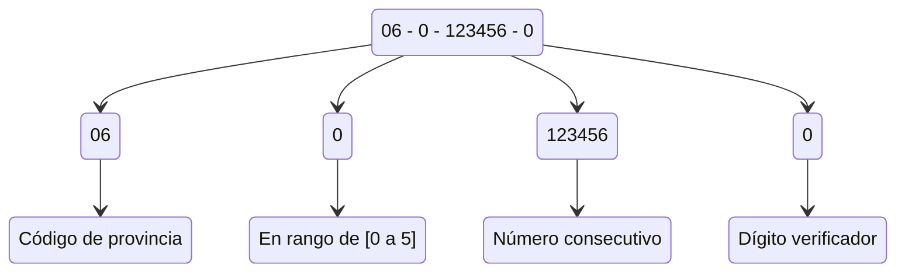
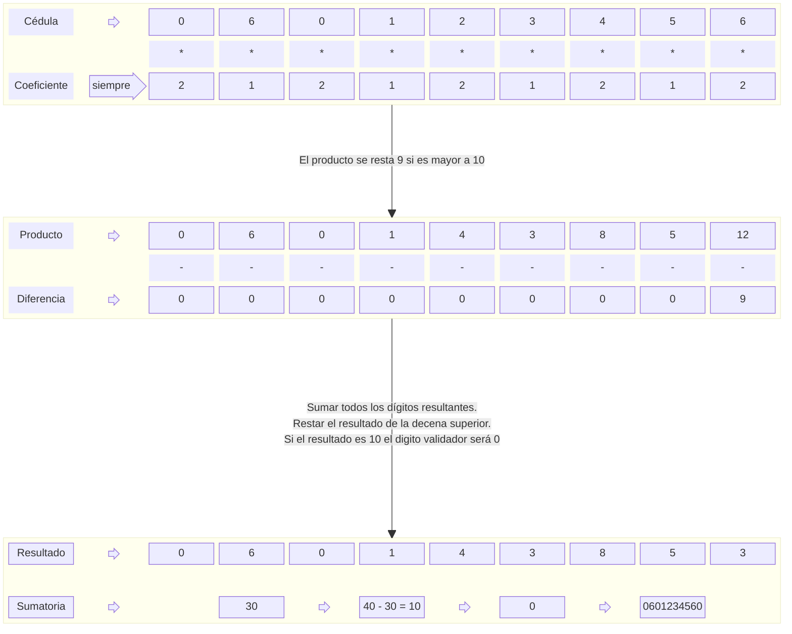
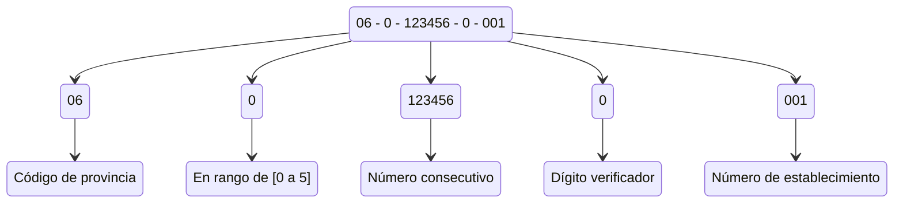
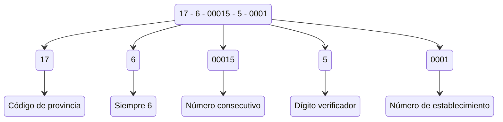
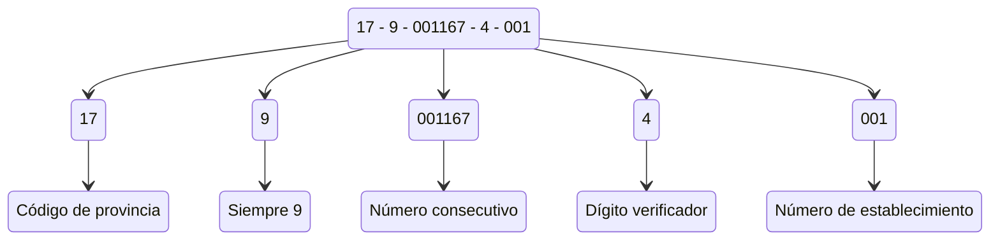

# ¿Cómo validar cédula y RUC en Ecuador?

En este documento encontrarás una guía clara para validar correctamente los números de **cédula** y **RUC** en Ecuador. Se detalla la estructura del RUC, los distintos tipos de contribuyentes y los algoritmos que se utilizan para verificar su validez: el **Módulo 10**, aplicado a cédulas y RUCs de personas naturales, y el **Módulo 11**, usado para validar RUCs de entidades públicas, jurídicas y extranjeras.

> ⚠️ **Fuente:** Este contenido se basa en el artículo original de Bryan Suárez publicado en [Medium](https://medium.com/@bryansuarez/c%C3%B3mo-validar-c%C3%A9dula-y-ruc-en-ecuador-b62c5666186f), donde se explica detalladamente el proceso de validación de cédula y RUC en Ecuador.

## Validación de la cédula

El número de cédula ecuatoriano contiene **10 dígitos**, donde:

1. Los dos primeros dígitos indican la provincia de emisión (de 01 a 24).
2. El tercer dígito debe estar en el rango de 0 a 5.
3. Del cuarto al noveno dígito forman un número secuencial.
4. El décimo dígito es el dígito verificador, calculado con el algoritmo *Módulo 10*.

### Algorítmo `Módulo 10`

Este algoritmo se aplica para validar cédulas y RUCs de personas naturales. Consiste en multiplicar los primeros nueve dígitos por un patrón alternado de coeficientes `2` y `1`, sumando los resultados y verificando que el décimo dígito (verificador) sea correcto.

Pasos:
1. Multiplicar los dígitos impares por 2 y los pares por 1.
2. Si algún producto es mayor que 9, restar 9.
3. Sumar todos los resultados.
4. Restar esa suma del siguiente múltiplo de 10.
5. El resultado debe coincidir con el último dígito de la cédula.

## Validación del RUC

La validación del RUC depende del tipo de contribuyente. Los métodos varían si el RUC pertenece a una persona natural, una entidad pública o una persona jurídica.

### Persona natural

Para personas naturales, los primeros 10 dígitos del RUC deben ser una cédula válida (validada con el algoritmo Módulo 10). El RUC termina en un código de establecimiento de tres dígitos (`001` usualmente).

Características:
- El tercer dígito está entre `0` y `5`.
- El décimo dígito se valida con *Módulo 10*.
- Los tres últimos dígitos (`001`) indican el establecimiento principal.

### Públicos

Los RUCs de entidades del sector público tienen el **tercer dígito igual a 6**, y su validación se realiza con el algoritmo *Módulo 11*.

Características:
- El dígito verificador (noveno) se valida con el algoritmo Módulo 11 usando los coeficientes `[3, 2, 7, 6, 5, 4, 3, 2]`.
- El dígito resultante se resta de 11 para obtener el verificador. Si el resultado es 11, se usa 0; si es 10, no es válido.
- El código de establecimiento debe ser `0001`.

### Jurídicos y extranjeros sin cédula

Este tipo de RUC corresponde a sociedades privadas o personas extranjeras sin cédula ecuatoriana. El **tercer dígito es 9**, y también se valida con el algoritmo *Módulo 11*.

Características:
- El dígito verificador (décimo) se valida con coeficientes `[4, 3, 2, 7, 6, 5, 4, 3, 2]`.
- La suma se resta de 11 para obtener el verificador. Si el resultado es 11, se usa 0; si es 10, no es válido.
- El código de establecimiento también es `001`.

